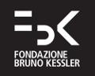
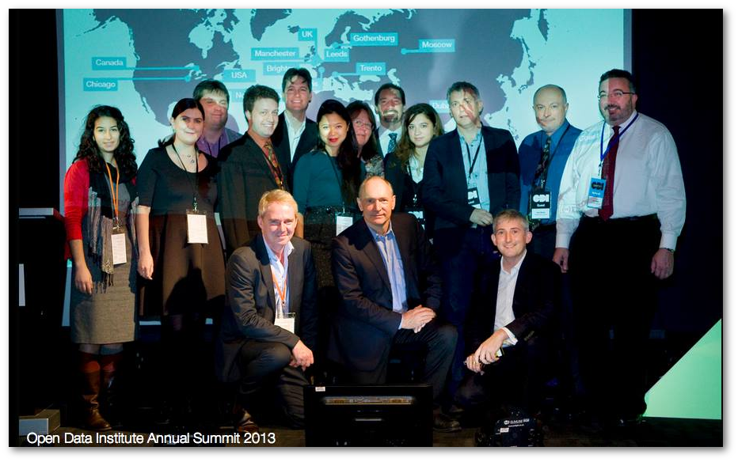
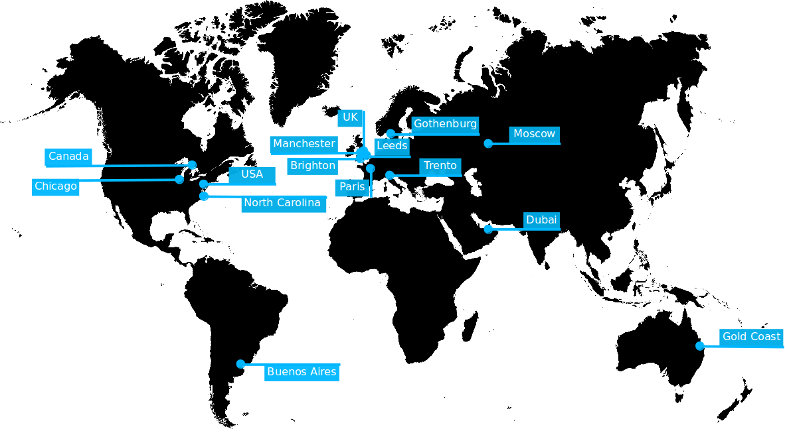

The FBK-ICT research center is since October 2013 the first Italian node of the Open Data Institute. Thanks to our active participation in the open data community, in September we could begin a conversation that eventually made FBK a city Node of the ODI. Starting from January 2014, FBK has established a brand new unit, The Digital Commons Lab, under the supervision of Maurizio Napolitano; it was assigned an autonomous space, located within the ICT Center, which will officially deliver projects as The ODI Node.

As our first commitment as an ODI Node, we are currently translating the Open Data Certificates into Italian. The translation team is composed of Maurizio Napolitano and Francesca De Chiara, members of the ODI node in Trento, and of Leda Bargiotti, a legal expert working for the Publications Office of the European Union in Luxembourg. The translation work is carried out as a collaborative project, and will be completed by January 2014. Further, the ODI Node - Trento is promoting the diffusion of the open data certificates in Italy: certificates are meant to be adopted by a large Italian power company, keen on testing and rating the quality of their released and available datasets. Developing the Open Data Certificates for our regional open data catalog will be the next step.

We are also involved in a national initiative with a potentially large impact: the Italian government agency AGID (Agency for the Italian Digital Agenda) is now writing up the final document of the national guidelines for the usage of digital instruments in the public administration, and the ODI Node Trento is deeply involved in the public discussion as a key contributor. Our proposal is to include in the final document the use of the Open Data Certificates (the Italian version) as an official recommendation.

We are discussing the creation of an autonomous Italian Open Data Institute, named “Istituto Italiano per i Dati Aperti”; the initiative stemmed from a group of consultants of the public administration. We are pointing out the need of a synergy with the ODI, that would eventually be carried out by our node.

We’ll address another challenge: developing validation instruments to enhance data accuracy and reliability, especially in the case of crowdsourced projects. We are interested in spreading the use of OpenStreetMap in order to raise citizens’ awareness and participatory planning (for example in case of emergencies). The fast progress in the mapping activity in the city of Matera (historical town in the Southern Italy) and the recent tragic events related to the Cleopatra cyclone in Sardinia show how valuable and necessary these collaborative and community-driven initiatives are. We are also planning to run training sessions, focused on open data reuse and digital storytelling; to stimulate the demand and conversation around the data involving NGOs, local companies and local government institutions. The lab’s members will also undertake at least one research project, involving some partners, and draft proposals in order to get funding.

http://theodi.org/nodes/trento 
